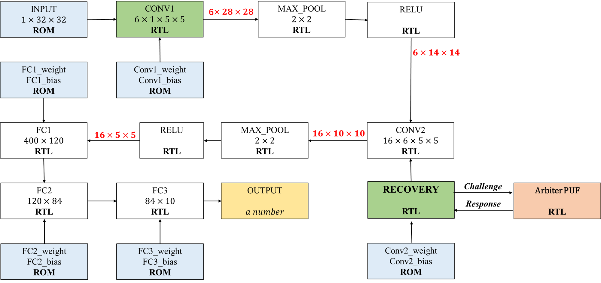

# Code Introduction
A Lenet model is generated using SystemVerilog and synthesized and implemented on FPGA.
# Copyright Notice
The main code is from the repository [cnn_open](https://github.com/lulinchen/cnn_open), removed the HDMI-related modules in the original project, only kept the Lenet model module, and rewritten <kbd>sources_1\new\lenet_top.sv</kbd>. Set the input and output, and set two output led1 and led2 to avoid the digit signal being optimized. Since there are only 2 LEDs on the FPGA, the calculation results of the model cannot be accurately displayed, which has no practical significance.
 
 # Implementation
**Develop Envirnment**: Vivado 2021.1\
**Product Family**: Kintex-7\
**Product Part**: XC7K325TFFG900\
**Product Doc**: http://www.alinx.vip:81/ug%2FAV7K325_UG.pdf

# Model Structure

